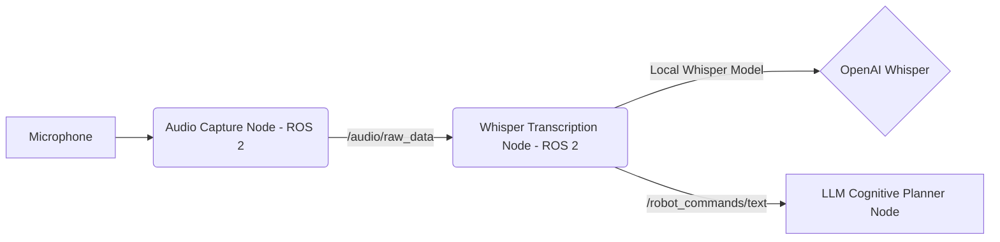

## The Gateway: Speech Recognition for Robots

For a robot to understand spoken commands, it first needs to convert human speech into text. This is the role of **Automatic Speech Recognition (ASR)**. While many ASR systems exist, **OpenAI Whisper** has emerged as a highly capable and versatile model.

## Why OpenAI Whisper?

Whisper is a neural network developed by OpenAI that was trained on a massive dataset of diverse audio and text. This extensive training gives it several advantages:

-   **High Accuracy:** Excels at transcribing speech even in noisy environments or with varied accents.
-   **Multilingual Support:** Can transcribe and translate speech in many languages.
-   **Robustness:** Less sensitive to background noise and speech variations compared to some other models.
-   **Open Source:** OpenAI has released the models and inference code, making it accessible for various applications.

## Using OpenAI Whisper

Whisper can be used in several ways:

1.  **OpenAI API:** If you have an OpenAI API key, you can send audio files to their cloud-based API for transcription. This is convenient for quick integrations.
2.  **Local Models:** You can run Whisper models locally on your own hardware. This is crucial for robotics where low latency and privacy are often paramount. Popular libraries like `whisper-jax` or community-contributed `whisper.cpp` allow for efficient local inference on CPUs and GPUs.

### Conceptual Integration with ROS 2

For a robot, we need to bridge the ASR output with the ROS 2 ecosystem. Here's a conceptual approach:

1.  **Audio Capture Node:** A ROS 2 node (e.g., `audio_capture_node`) subscribes to raw audio data from a microphone (or a simulated audio source). This could be a `sensor_msgs/Audio` message type.
2.  **Whisper Processing Node:**
    -   This node (e.g., `whisper_transcription_node`) subscribes to the raw audio topic.
    -   It processes chunks of audio data using a locally running Whisper model.
    -   Once speech is detected and transcribed, it publishes the resulting text as a `std_msgs/String` message to a new ROS 2 topic (e.g., `/robot_commands/text`).



### Example: Simple Command Parsing

Once we have the transcribed text, the next step is to extract meaningful commands. For simple scenarios, a basic keyword spotting or rule-based parser can work:

```python
# In the Whisper Transcription Node, after receiving text
def process_command_text(text_command):
    text_command = text_command.lower()
    if "go forward" in text_command:
        return "MOVE_FORWARD"
    elif "stop" in text_command:
        return "STOP"
    elif "clean the room" in text_command:
        return "COMPLEX_TASK_CLEAN_ROOM" # This requires an LLM!
    else:
        return "UNKNOWN_COMMAND"

# Publish this parsed command to a specific topic
```

While simple parsing works for direct instructions, natural language commands often contain ambiguity, context, and high-level intent that requires more sophisticated processing. This leads us to the next lesson: leveraging Large Language Models for cognitive planning.
